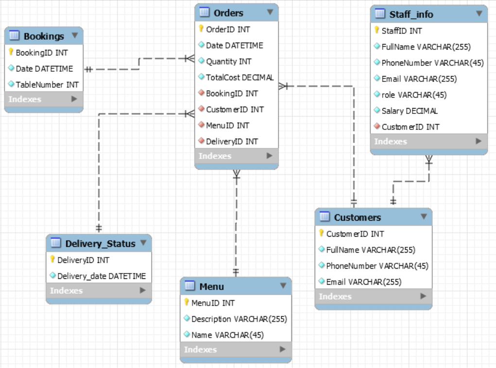
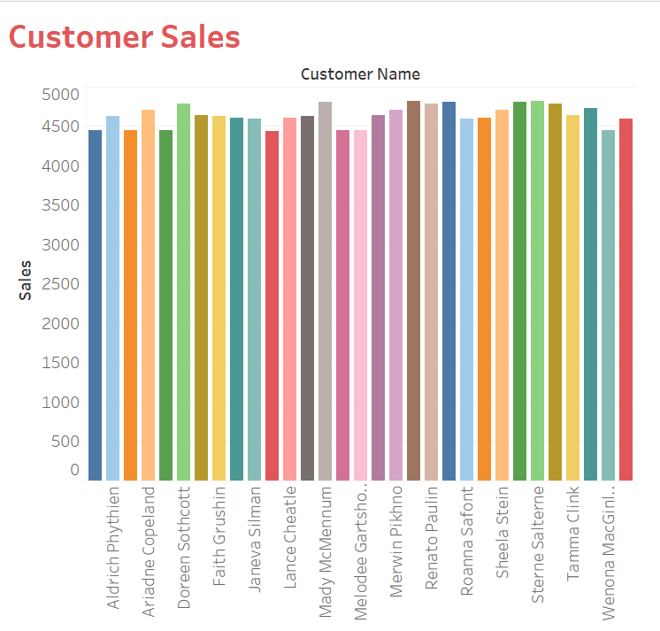
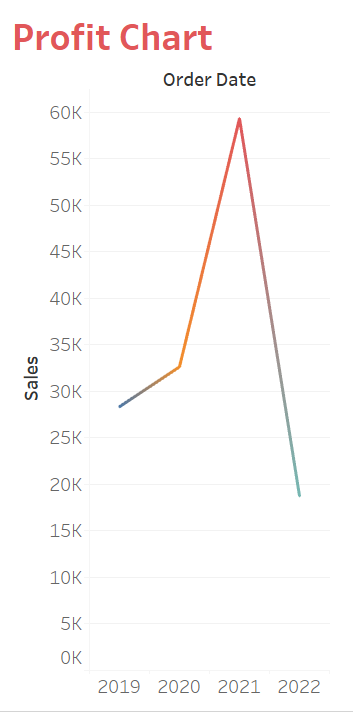
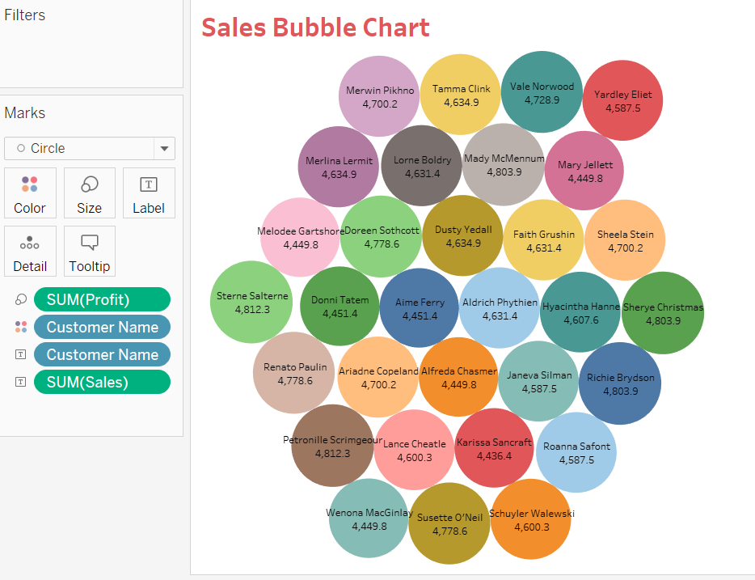
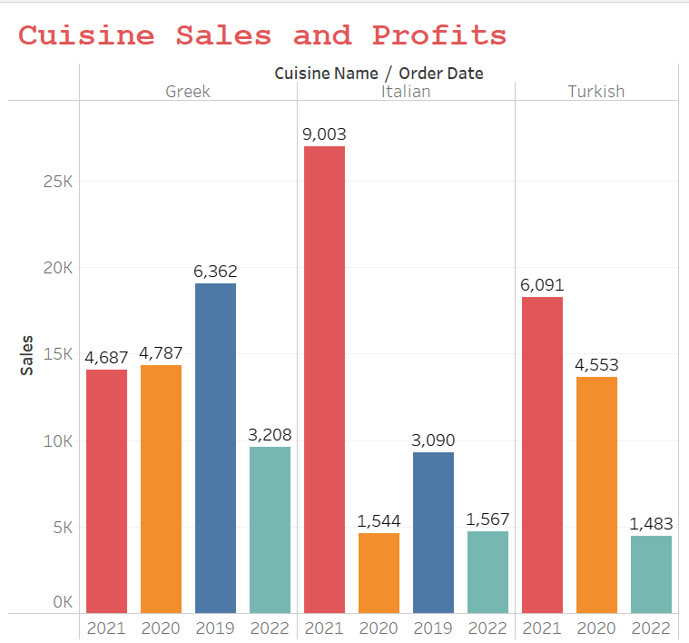
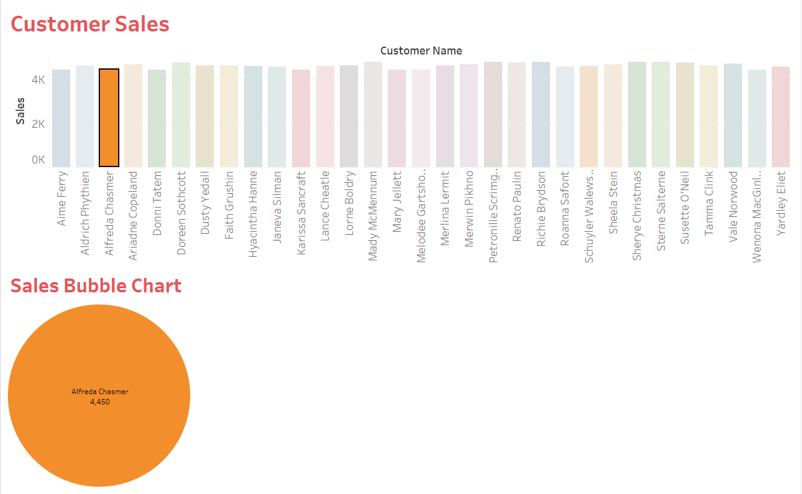

# metabase_data_enginering_capstone_project

## Project Description

This project is a part of the **Meta Database Engineer Certificate** course on Coursera. The project uses MySQL for database modeling and Tableau for data analysis, and it is designed to set in progress operations of Little Lemon fast-food restaurant.
All files in this repository contains all the files used for this project.

## Set Requirement

1. **MYSQL Server**
2. **MYSQL WorkBench**
3. **Git and Github**
4. **Jupyter Notebook**

## Task One - Creating ER Diagram Model

Obtain the file to ER Diagram here [LittleLemonDM.sql](./LittleLemonDM.sql) 

## Task Two - Database Queries, Procedures and Prepared Statements

1. Exercise one solution - [SQL File](./Exercise-solutions/Creating%20Virtual%20Table%20Solution%20to%20Exercises.sql)
2. Exercise two solution - [SQL File](./Exercise-solutions/SQL%20queries%20to%20check%20available%20bookings%20Solution%20Exercises.sql)
3. Exercise three solution - [SQL File](./Exercise-solutions/create%20SQL%20queries%20to%20add%20and%20update%20bookings.sql)
4. Exercise four solution - [SQL file](./Exercise-solutions/Create%20optimized%20queries%20solution%20to%20Exercises.sql)

## Task Three - Database Clients

- [Solution to Database Clients](./Database%20Client%20Exercise%20Solution.ipynb)

## Data Analysis with Tableau

1. **Customer Sales**

2. **Profit Chart**

3. **Sales Bubble Chart**

4. Cuisine Sales and Profits

5. **Dashboard**
